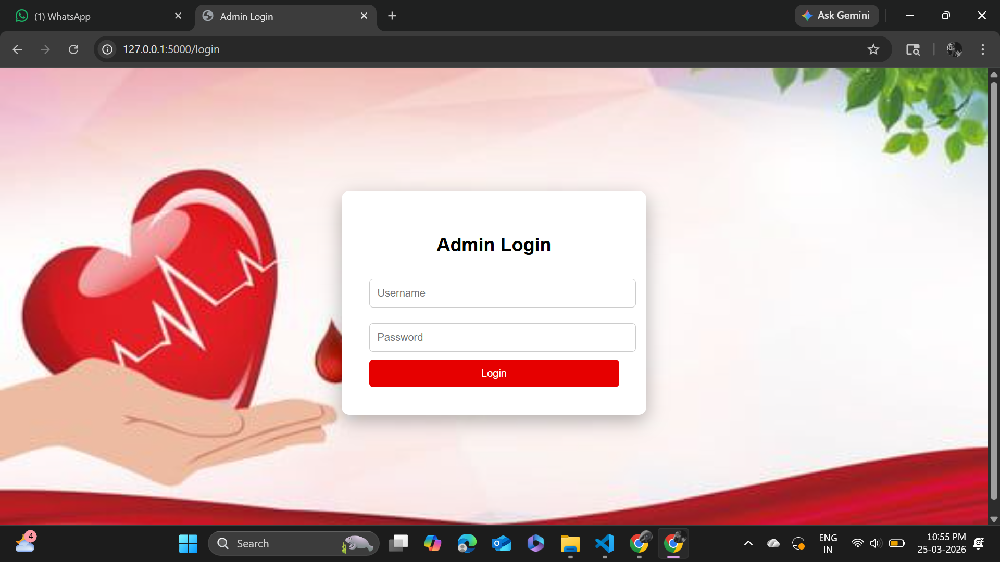
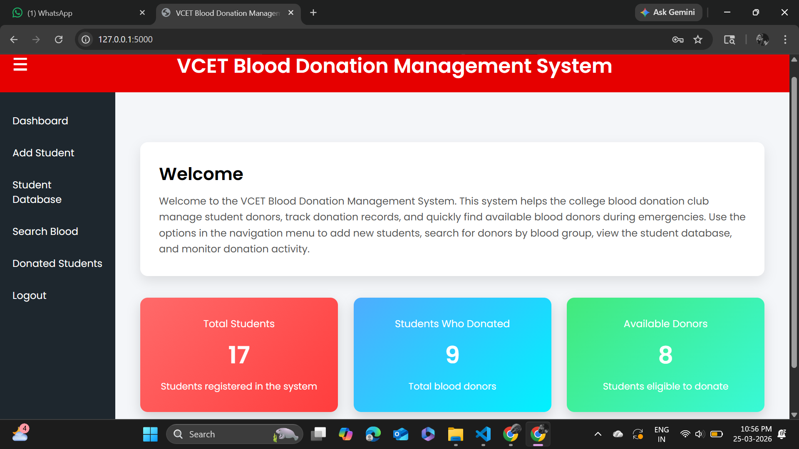
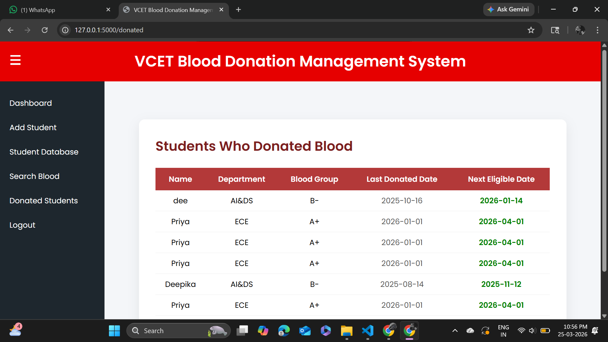
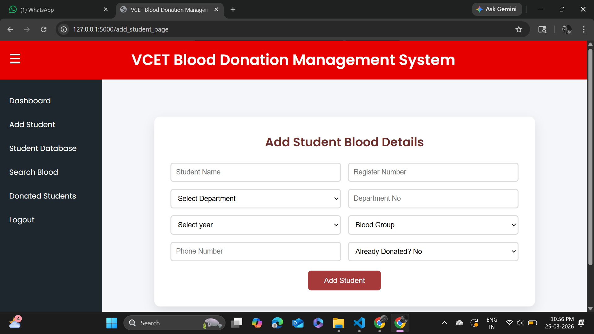
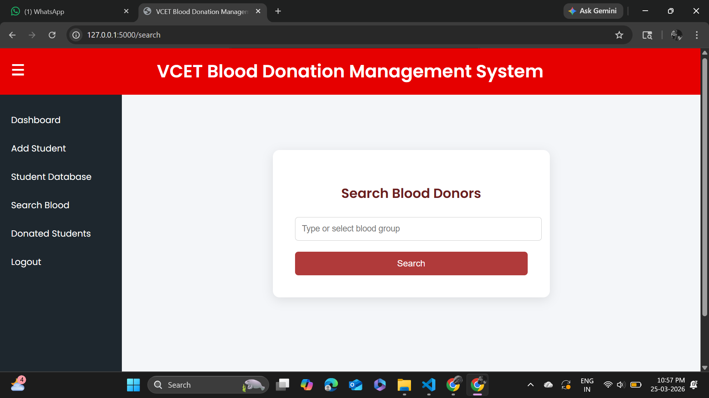
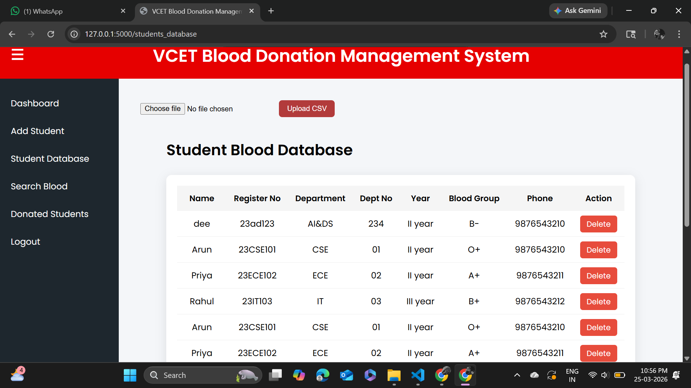

# Blood Donation Management System

## 📌 Description
This project helps manage blood donors in a college environment.

## 🚀 Features
- Donor Registration
- Search Donors
- Blood Group Filtering
- Data Storage using SQLite

## 🛠 Tech Stack
- Python (Flask)
- HTML, CSS
- SQLite

## ▶️ How to Run
pip install -r requirements.txt
python app.py

## 📷 Screenshots

## 👩‍💻 Author
Deepika
